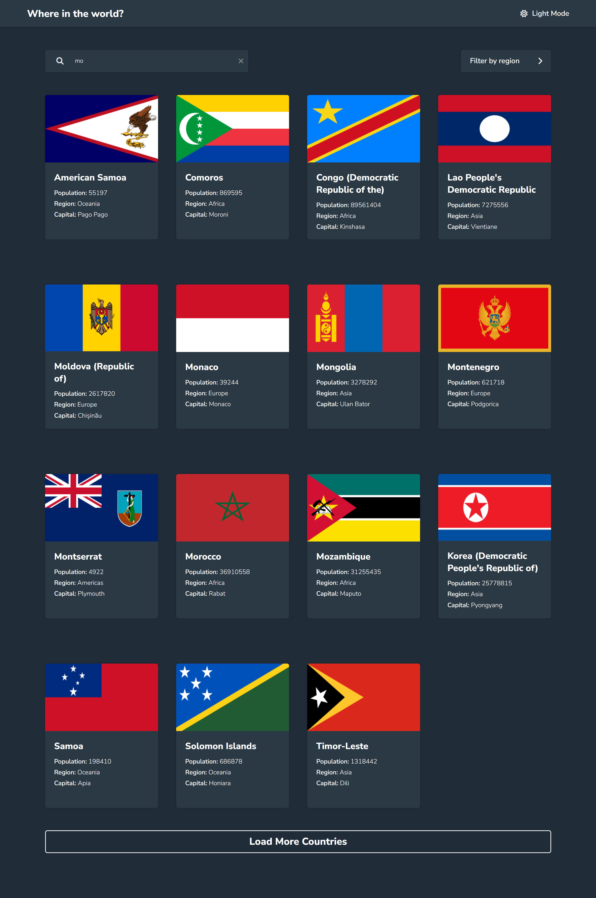
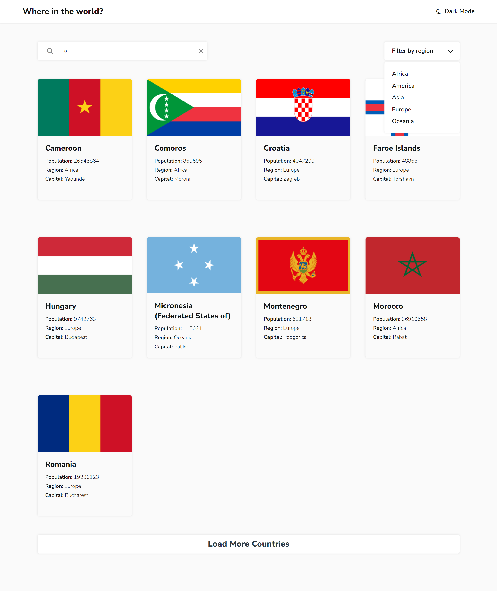
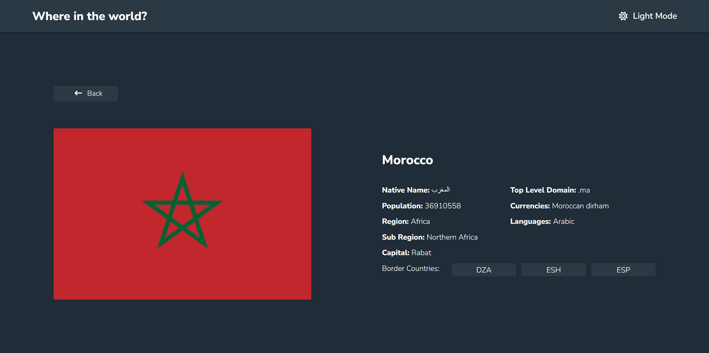
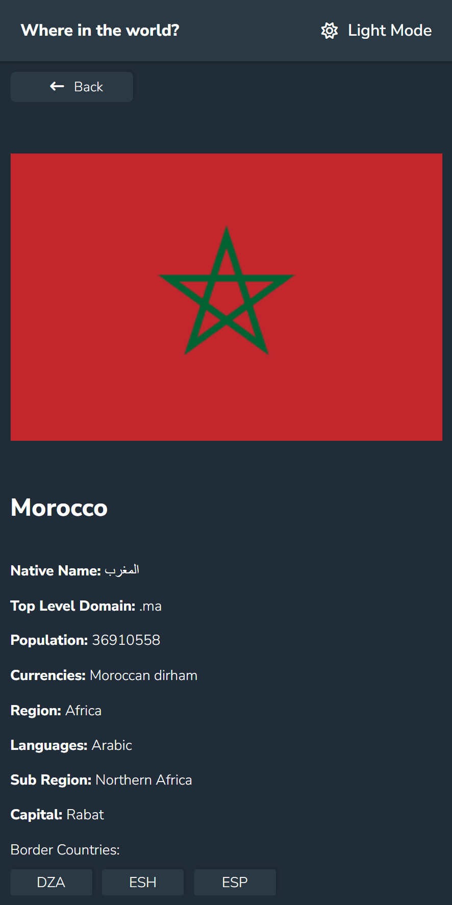

# Frontend Mentor - REST Countries API with color theme switcher solution

This is a solution to the [REST Countries API with color theme switcher challenge on Frontend Mentor](https://www.frontendmentor.io/challenges/rest-countries-api-with-color-theme-switcher-5cacc469fec04111f7b848ca). Frontend Mentor challenges help you improve your coding skills by building realistic projects. 

## Table of contents

- [Frontend Mentor - REST Countries API with color theme switcher solution](#frontend-mentor---rest-countries-api-with-color-theme-switcher-solution)
  - [Table of contents](#table-of-contents)
  - [Overview](#overview)
    - [The challenge](#the-challenge)
    - [Screenshot](#screenshot)
      - [1. Dark View](#1-dark-view)
      - [2. Light View](#2-light-view)
      - [3. Details](#3-details)
      - [4. Details In Phone](#4-details-in-phone)
    - [Links](#links)
  - [My process](#my-process)
    - [Built with](#built-with)
  - [Author](#author)
  - [Contributing](#contributing)
  - [Show Your Support](#show-your-support)

## Overview

### The challenge

Users should be able to:

- See all countries from the API on the homepage
- Search for a country using an `input` field
- Filter countries by region
- Click on a country to see more detailed information on a separate page
- Click through to the border countries on the detail page
- Toggle the color scheme between light and dark mode

### Screenshot
#### 1. Dark View

#### 2. Light View

#### 3. Details

#### 4. Details In Phone

### Links

- Solution URL: [here](https://github.com/Slimani-CE/front-end-mentor-ch15)
- Live Site URL: [here](https://slimani-ce.github.io/front-end-mentor-ch15)

## My process

### Built with

- Semantic HTML5 markup
- CSS custom properties
- Flexbox
- CSS Grid

## Author

- Website - [https://slimani-ce.github.io/](https://slimani-ce.github.io/)
- Frontend Mentor - [@Slimani-CE](https://www.frontendmentor.io/profile/Slimani-CE)
- Twitter - [@mstapha4real](https://twitter.com/mstapha4real)

## Contributing
Contributions are always welcome! If you find any issues with the code or have suggestions for improvements, please feel free to submit a pull request.

Just remember, we are not responsible for any broken keyboards or late-night coding sessions that may result from your contributions! 😄

## Show Your Support
If you found this notebook helpful, please give it a ⭐️ to show your support!
